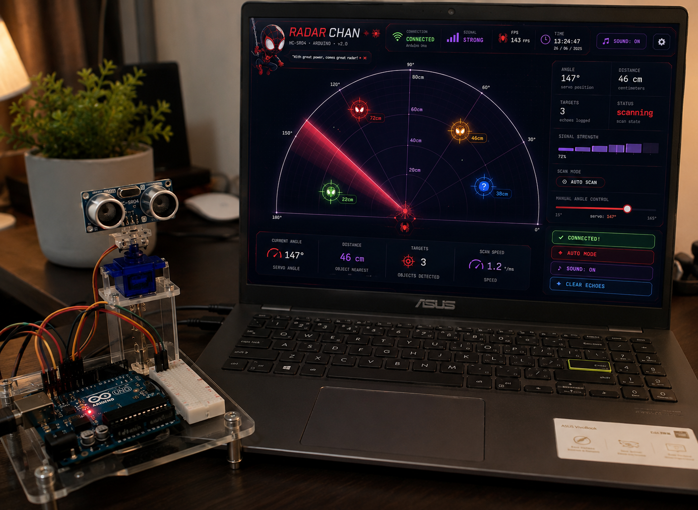

<div align="center">

# 🕷️ RADAR CHAN

### Futuristic Arduino Radar using HC-SR04 + Servo + Web Serial

A real-time cyberpunk-inspired radar visualization built using **Arduino Uno**, **HC-SR04 Ultrasonic Sensor**, **SG90 Servo Motor**, and a modern **HTML/CSS/JavaScript** interface.



<br>


**Real-Time Object Detection • Interactive Radar • Web Serial API**

</div>

---

# 📖 Overview

RADAR CHAN is a browser-based radar visualization that communicates directly with an Arduino through the **Web Serial API**.

The Arduino rotates an ultrasonic sensor using a servo motor, continuously measuring surrounding objects. Distance and angle data are streamed to the browser, where they are rendered as a futuristic animated radar interface.

---

# ✨ Features

- 🎯 Real-time object detection
- 📡 180° radar scanning
- ⚡ Web Serial communication
- 🌐 Browser-based interface
- 🎨 Futuristic Spider-themed UI
- 📊 Live angle & distance display
- 🔄 Auto scanning mode
- 🎮 Manual servo control
- 📈 Signal strength visualization
- 🔊 Sound effects
- 💻 Works directly in Chrome / Edge

---

# 🛠 Hardware Used

| Component | Quantity |
|-----------|----------|
| Arduino Uno | 1 |
| HC-SR04 Ultrasonic Sensor | 1 |
| SG90 Servo Motor | 1 |
| Breadboard | 1 |
| Jumper Wires | Several |
| USB Cable | 1 |

---

# 🔌 Circuit Connections

## HC-SR04 Ultrasonic Sensor

| HC-SR04 | Arduino Uno |
|----------|-------------|
| VCC | 5V |
| GND | GND |
| TRIG | D10 |
| ECHO | D11 |

---

## SG90 Servo Motor

| Servo | Arduino Uno |
|--------|-------------|
| Red (VCC) | 5V |
| Brown/Black (GND) | GND |
| Orange (Signal) | D12 |

---

# 📂 Repository Structure

```
Radar-Chan/
│
├── index.html          # Radar Dashboard
├── sketch_apr10a.ino   # Arduino Program
├── img.png             # Project Preview
└── README.md
```

---

# 🚀 Getting Started

## 1. Upload Arduino Code

Open

```
sketch_apr10a.ino
```

Upload it to your Arduino Uno.

---

## 2. Open the Dashboard

Simply open

```
index.html
```

using **Google Chrome** or **Microsoft Edge**.

---

## 3. Connect Arduino

Click

```
CONNECTED!
```

Choose your COM port and start scanning.

---

# 📡 Serial Communication

The Arduino continuously sends data in the format:

```
ANGLE,DISTANCE
```

Example

```
90,34
```

where

- 90 → Servo Angle
- 34 → Distance in centimeters

---

# ⚙️ Technologies Used

- HTML5
- CSS3
- JavaScript
- Canvas API
- Arduino C++
- Web Serial API

---

# 🎯 Future Improvements

- ESP32 Wi-Fi Support
- Multiple Object Tracking
- AI Object Recognition
- Radar Data Recording
- Mobile Responsive UI
- 3D Radar Visualization
- Voice Alerts

---

# 👨‍💻 Author

**Madhav M N**

GitHub

https://github.com/Maddy2k6

LinkedIn

https://linkedin.com/in/madhav-m-n-3b4308380

---

<div align="center">

⭐ If you like this project, consider giving it a star!

Made with ❤️ using Arduino + JavaScript

</div>
